```mermaid
graph LR
A[ESP32] --> B(Sistema de Riego Automático)
C[Arduino] --> D(Carretilla Autónoma)
E[Blender] --> F(Modelado 3D Académico)
```

# 👋 Hola, soy Ian Sierra

**🎓 Estudiante de Ingeniería en Sistemas Computacionales**  
📍 Tecnológico de Uruapan, Mich. | 💻 **Apasionado por el desarrollo full-stack y sistemas embebidos**  
🚀 Enfoque en soluciones innovadoras que integran software, hardware y Redes.

---

## 🔧 Habilidades Técnicas

### **Lenguajes de Programación**


### **Desarrollo Web**


### **Bases de Datos & DevOps**


### **Hardware & Sistemas Embebidos**


---

## 🚀 Proyectos Destacados

### [Gestor de Inventario Violetta](https://github.com/IanSierra/gestor-inventario-violetta)
[](https://github.com/IanSierra/gestor-inventario-violetta)

**Stack:** React + TypeScript + Node.js + PostgreSQL  
**Features:**  
✅ Dashboard en tiempo real  
✅ Gestión multirol (admin/vendedor)  
✅ Sistema de transacciones complejas  

| **Otros Proyectos** | |
|----------------------|---------|
| **[Gestor de Red](enlace)** | Aplicación web para administración de redes corporativas |
| **[Robótica Educativa](enlace)** | Minisumo electrónico con ESP32 |
| **[Visualización 3D](enlace)** | Diagramas interactivos para proyectos universitarios |

---

## 📚 Formación Académica
**Ingeniería en Sistemas Computacionales**  
✅ **Áreas Clave Dominadas:
- Desarrollo Full-Stack (React/Node.js)
- Sistemas Embebidos y IoT
- Gestión de Bases de Datos
- Inteligencia Artificial

**Cursos Destacados:**  
`Programación Funcional (Haskell)` | `Arquitectura de Software`  
`Redes de Computadoras` | `Sistemas Programables`

---

## 📊 Estadísticas GitHub


---

## 🛠️ Hardware Projects


---

## 📫 Contáctame
[](https://linkedin.com/in/tu-perfil)
[](mailto:tucorreo@dominio.com)
[](https://tu-portafolio.com)

✨ *"Donde los circuitos encuentran su alma en el código"* ✨
```

